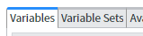
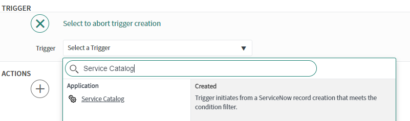
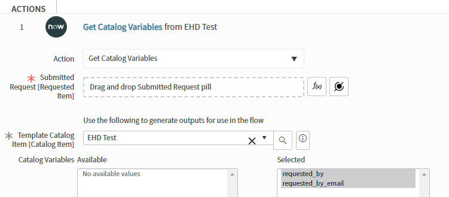
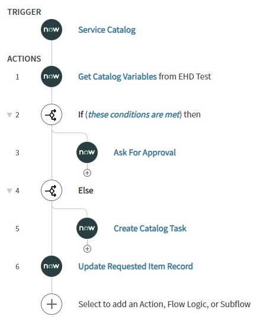

# Creating a complete catalog item
Objective: learn about catalog items, the request catalog, request items, business rules, variables, variable sets, UI policies, client scripts, and workflows.

Login to your personal developer instance.

### Create the catalog item
1. Go to the Catalog Items table (Look for Request Catalog Configuration > Catalog Defnitions > Maintain Items)
2. Create new
3. Fill out these values:
	1. Name: [your name]'s Test Catalog Item
	2. Catalogs: Pick an existing catalog in the picker
	3. Category: Student Practice (you might have to make this if someone hasn't already made it for you)
	4. Short Description: A catalog item designed for practicing servicenow admin fundamental skills
	5. Portal Settings, Request method: Submit
4. Right click the header and select save
5. See if your catalog item shows up in your service portal (go to `your_instance_name`.service-now.com/sp)

### Add variables/variable sets
1. Scroll down to the related lists section (the tabs at the bottom not to be confused with Related Links)



2. At any time during your catalog item creation, feel free to go to your catalog item in the ServiceHub and change around these values to see how they affect how your form looks.
	* The order value changes the position of each variable field. The least-valued variable will be at the top of the page and the greatest-valued will be at the bottom.
3. Go back to the related lists for your catalog items and let's begin creating some variables for you to submit. Click "New" on the variables related list tab to make the following simple variables (pressing submit after each one):
	* First variable
		1. Type: Single Line Text
		2. Mandatory: True
		3. Order: 100
		4. Question: [whatever you want]
		5. Name: u_[a variable name with no spaces]
	* Second Variable
		1. Type: CheckBox
		2. Order: 200
		3. Question: [whatever you want]
		4. Name: u_[a variable name with no spaces]
4. Variables can be created and deleted directly on catalog items. Or they can be made in a "Variable Set" which can be included in several catalog items. On the variable set tab, press edit and add the "Requested By Only" variable set and give it an order of 0.
5. Remember: Variables can be added or deleted from your catalog item, but for variable sets, there is a big difference between adding and removing them from your catalog item vs. deleting the variable set. The latter, deletes it from the database entirely (instead of just removing it from your form) even if other forms were using it too.
6. Go and test your form in the portal. Fill it out and submit it.

### Catalog Items vs. Request Items
Catalog items is the form (or template if that's easier to understand) that is gathering information from the user. 

When a user submits a catalog item on the ServiceHub, it creates a Request Item. It basically takes a snapshot of the catalog item you made along with the answers the user submitted and saves it as a record on the request item table.

Go back to ServiceNow and find the request item table (Request Catalog > Active > Items). Find your submitted request item. (hint: sort by descending number, your's is probably the newest one) and open it.

Look at the variables section and see how it captured the information that you inputted.

### UI Policies
1. Go back to your Catalog Item (not request item)
2. Go to the "Catalog UI Policies" related list and hit new
3. Configure the UI Policy as follows
	* Short Description: Hide stuff
	* Catalog Conditions: Pick the custom checkbox variable you made earlier (should start with u_) and make the condition "is true"
	* Right click the header and select save
	* Scroll down to the "Catalog UI Policy Actions" related list and click new
	* Variable name: the other custom variable you made earlier
	* Mandatory: False
	* Visible: False
	* Click submit
4. Go back to the portal and check out your catalog item again. Click on the checkbox and see what the UI Policy does.

Where this seems to be pretty basic functionality, this is good place to recognize that having dynamic forms that are easy to create is incredibly useful to organizations, especially to those who still operate off of word documents, pdfs, and excel worksheets to gather this information.

### Client Scripts
1. Go back to your Catalog Item (not request item)
2. Deactivate the UI Policy first and then proceed.
3. Go to the "Catalog Client Scripts" related list and hit new
4. Configure it as follows:
	* Name: Add info
	* UI Type: All
	* Type: On Change
	* Variable name: your checkbox variable
	* Script: 
```g_form.setValue('u_[your string variable name]', 'Checkbox is ' + newValue);```
5. Go back to the ServiceHub portal and check out your catalog item again. Click on the checkbox and see what the catalog item script does.

Notice that Client Scripts opens up your catalog item to basically any form of customization. You can now validate fields, you can manipulate fields based on previous fields, and with some advanced ServiceNow scripts, you can even make live calls and writes to the database before the form is even submitted.

### Practice
Take this time to go back to your catalog item and add more variables of different types to get some familiarity with some more common ones:
* Date
* Multiple Choice (notice that you have to submit the variable first before you're able to make options)
* Reference (try referencing the User [sys_user] table in this variable)
* Yes/No
* Others

After you add more variables and play with the settings and other available tabs. Go practice more usage of UI Policies and Catalog Scripts.

You can look at <https://docs.servicenow.com/bundle/paris-servicenow-platform/page/product/service-catalog-management/concept/c_IntroductionToCatalogItems.html> for official documentation. Don't worry about flows yet, we'll get there next.

### Flows
You catalog item right now has some good, core functionality. When a user submits it, it creates a record of information that people can review.
Go back to your catalog item and notice that on the Process Engine there is a field called "Flow." Next, we'll go over making a flow so that when a user submits it, some automation will be kicked off.

1. In the navigator, go to "Process Automation > Flow Designer" and it will open the workfflowlow interface.
2. Click on "New Flow" and use these initial values:
	* Name: IET Test Workflow - [Your name]
3. Submit

Note: Flows are powerful, and with great power comes great responsibility. It is an admin-only tool and it has the potential to automate a lot of things but also has the risk of breaking and destroying a lot of things. 

4. Flows can be triggered by many things, but we want this to be triggered by your catalog item. So under Trigger, set it to Service Catalog



5. Flows only pull in information when explictly told (to save memory), so we need to pull the user's answers first. So for your first action, add the ServiceNow Core action called "Get Catalog Variables"
	* Click the data pill picker . You will only see one trigger here because we only set one trigger above. Select "Trigger - Service Catalog > Requested Item" to attach the trigger to the "Submitted Request" field
	* Select your catalog item for "Template Catalog" field
	* Select all your catalog variables that are available



6. For your next action, select Flow Logic > "If"
	* Use the datapicker and get your checkbox variable from Action #1
	* Check for if true

7. Under the If branch, add another action from the ServiceNow Core called "Ask for Approval"
	* Record should be your trigger once again (this should fill out several other fields)
	* For Rules > -Choose Approval Rule field, set it to "Anyone Approves" and then click  and add yourself. If you find multiple instances of your name, select a few of them to add to the approval list (one of them _will_ go through)
8. On the main branch of your flow, add the "Else" flow logic action.
9. Under the Else branch, add another action from the ServiceNow Core called "Create Catalog Task"
	* Requested Item should be your trigger once again
	* Put any short description you want (usually an action like: Fulfill, or fix this, etc.)
	* For fields, do add field value > select a field > "Assignment group" and set the assignment group to ITS-SNOW-Students. Add another field value called  "Assigned to", and add yourself. Again, if you have multiple instances, add a few.
	* For Template Catalog Item, select your catalog item, and pull in all your variables from your catalog item
10. On the main branch of your flow, add a "Update Record" action
	* Record should be your trigger
	* For fields, do add field value > "Status", and set it to "Closed Complete"
11. Save your flow and activate it.
12. That's it! Your flow should have the same steps as this image:



13. Go back to your catalog item
14. In the flow field, add your flow and save/update your item

Your catalog item now has this functionality:
* Upon submission, the user is emailed letting them know that we received their request (this happens automatically without your configuration).
* If the user did not mark the checkbox question as true, then it will create a task for you to complete and the task will remain open until that task is completed before the flow continues.
* If the user marked the checkbox question as true/checked, then it will send an approval request to you first, and upon approval the flow will continues
* If the task is completed, then a "completed" email is sent to the user

A lot more functionality just from a simple flow!

Go and actually test these scenarios by submitting your form several times. You can see "approvals" and "tasks" show up on the request item record after you submit the form.
* To approve or reject an approval you can either impersonate the approver and check the service portal, or type Approvals in the app nav.
* To complete a Catalog Task, go to the newly created request item and scroll down to the "Catalog Tasks" related list

Did everything happen that you expected? **If this is not working for you, double check your Catalog Item to see if your Process Engine > Flow has your Flow there.**

As an additional note: we do have some other standards regarding what should always be included in a catalog item and flow, but you'll learn those as time progresses.

### Conclusion and tips
And that's it! That's a crash course on how to make Catalog items and flows for the resulting request items. Take some time to play around and try more things in your catalog item and workflow.
* Note that if you want to edit your flow again, you'll want to make sure to activate it after saving it.
* You can type shortcuts into the filter navigator to get to places you want faster:
	* [table name].list brings you to a list of records on that table, for instance try these:
		* sc_cat_item.list
		* sc_req_item.list
	* [table name].do brings you to the "create new" form of that table
