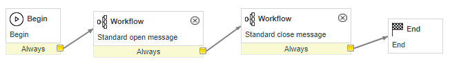
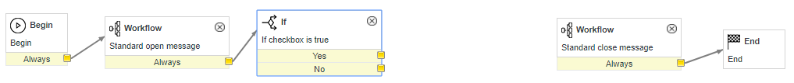
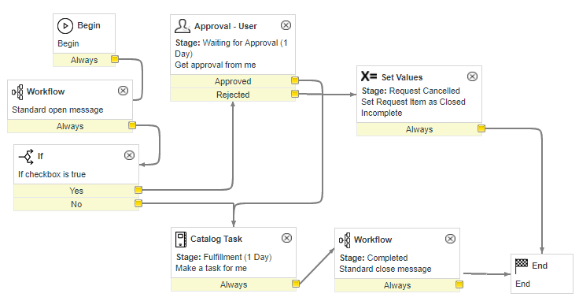

# Creating a complete catalog item
Objective: learn about catalog items, the request catalog, request items, business rules, variables, variable sets, UI policies, client scripts, and workflows.

Login to your personal developer instance.

#### Create the catalog item
1. Go to the Catalog Items table (Look for Service Catalog > Open Records > Maintain Items)
2. Create new
3. Fillout these values:
a. Name: [your name]'s Test Catalog Item
b. Availability: Desktop and mobile
c. Catalogs: IT Campus Services
d. Category: Student Practice
e. Short Description: A catalog item designed for practicing servicenow admin fundamental skills
4. Right click the header and select save
5. See if your catalog item shows up in your service portal (go to `your_instance_name`.service-now.com/sp)

#### Add variables/variable sets
1. Scroll down to the related lists section (the tabs at the bottom not to be confused with Related Links)
2. All of our request items tend to have at least two variable sets. Add these and save:
	* Contact Information
	* Additional Information
3. Go back to the variable sets related list and change the order as the following
	* Contact Information: 0
	* Additional Information: 10000
4. At any time during your catalog item creation, feel free to go to your catalog item in the ServiceHub and change around these values to see how they affect how your form looks.
	* The order value changes the position of each variable field. The least-valued variable will be at the top of the page and the greatest-valued will be at the bottom.
5. Go back to the related lists for your catalog items and let's begin creating some variables for you to submit. Click "New" on the variables related list tab to make the following simple variables (pressing submit after each one):
	* First variable
		1. Type: Single Line Text
		2. Mandatory: True
		3. Order: 100
		4. Question: [whatever you want]
		5. Name: u_[a variable name with no spaces]
	* Second Variable
		1. Type: CheckBox
		2. Order: 200
		3. Question: [whatever you want]
		4. Name: u_[a variable name with no spaces]
6. Go and test your form in the ServiceHub portal. Fill it out and submit it.

#### Catalog Items vs. Request Items
Catalog items is the form (or template if that's easier to understand) that is gathering information from the user. 

When a user submits a catalog item on the ServiceHub, it creates a Request Item. It basically takes a snapshot of the catalog item you made along with the answers the user submitted and saves it as a record on the request item table.

Go back to ServiceNow and find the request item table (Service Catalog > Open Records > Request Items). Find your submitted request item. (hint: sort by number, yours is probably the newest one) and open it.

Look at the variables tab and see how it captured the information that you inputted.

#### UI Policies
1. Go back to your Catalog Item (not request item)
2. Go to the "Catalog UI Policies" related list and hit new
3. Configure the UI Policy as follows
	* Short Description: Hide stuff
	* Catalog Conditions: Pick the custom checkbox variable you made earlier (should start with u_) and make the condition "is true"
	* Right click the header and select save
	* Scroll down to the "Catalog UI Policy Actions" related list and click new
	* Variable name: the other custom variable you made earlier
	* Mandatory: False
	* Visible: False
	* Click submit
4. Go back to the ServiceHub portal and check out your catalog item again. Click on the checkbox and see what the UI Policy does.

Where this seems to be pretty basic functionality, this is good place to recognize that having dynamic forms that are easy to create is incredibly useful to organizations, especially to those who still operate off of word documents, pdfs, and excel worksheets to gather this information.

#### Client Scripts
1. Go back to your Catalog Item (not request item)
2. Deactivate the UI Policy first and then proceed.
3. Go to the "Catalog Client Scripts" related list and hit new
4. Configure it as follows:
	* Name: Add info
	* UI Type: All
	* Type: On Change
	* Variable name: your checkbox variable
	* Script: add the following beneath the "//Type appropriate comment" comment and submit: 
```g_form.setValue('u_[your string variable name]', 'Checkbox is ' + newValue);```
5. Go back to the ServiceHub portal and check out your catalog item again. Click on the checkbox and see what the catalog item script does.

Notice that Client Scripts opens up your catalog item to basically any form of customization. You can now validate fields, you can manipulate fields based on previous fields, and with some advanced ServiceNow scripts, you can even make live calls and writes to the database before the form is even submitted.

#### Practice
Take this time to go back to your catalog item and add more variables of different types to get some familiarity with some more common ones:
* Date
* Multiple Choice (notice that you have to submit the variable first before you're able to make options)
* Reference (try referencing the User [sys_user] table in this variable)
* Yes/No
* Others

After you add more variables and play with the settings and other available tabs. Go practice more usage of UI Policies and Catalog Scripts.

You can look at https://docs.servicenow.com/bundle/jakarta-it-service-management/page/product/service-catalog-management/concept/c_IntroductionToCatalogItems.htmlfor official documentation. Don't worry about workflows yet, we'll get there next.

#### Workflows
You catalog item right now has some good, core functionality. When a user submits it, it creates a record of information that people can review.
Go back to your catalog item and notice that there is a field called "Workflow." Next, we'll go over making a workflow so that when a user submits it, some automation will be kicked off.

1. In the navigator, go to "Workflow > Workflow Editor" and it will open the workflow interface.
2. Click on "New Workflow" and use these initial values:
	* Name: IET Test Workflow -[Your name]
	* Table: Requested Item [sc_req_item]
3. Submit

Note: Workflows are powerful, and with great power comes great responsibility. It is an admin-only tool and it has the potential to automate a lot of things but also has the risk of breaking and destroying a lot of things. 

On the workflows tab in the right side of the workflow interface, pull in the "Standard open message" and "Standard close message" workflows (just hit save on the dialogue box that appears)

4. Adjust the layout of the four tiles so that they go in this order:



5. Right now, this workflow sends an email to the requester (Standard open message) letting them know their request item is being worked on, and then immediately sends an email saying that their request item has been completed (Standard close message). Let's make it a bit more complex
6. Go to the "core" tab on the right. This tab contains all the tile types you can add to your workflow to automate your form
7. Drag and drop the tile "Core Activities > Conditions > If" onto your workflow and it will open a dialogue box, put these values:
	* Name: If checkbox is true
	* Condition: in the first box, choose "variables" and then choose your catalog item for "Select Item" and then choose your checkbox variable for "Select Variable" and set it to "is true"

	

	* Hit save
8. Position this new "If" tile after the "Standard open message tile" and connect the two with an arrow, you can leave the "standard close message" tile as disconnected for now



9. Add another tile: "Core Activities > Approvals > Approval –User":
	* Name: Get approval from [your name]
	* Stage: Waiting for approval
	* Users: click the  icon to add your name to this list
	* Save
10. Attach this approval activity to the "yes" part of your "if" activity
11. Add another tile: "Core Activities > Tasks > Catalog Task"
	* Name: Make a task for [your name]
	* Stage: Fulfillment
	* Assigned to: [you]
	* Short description: FIX_THIS
	* Click "Advanced" under script
	* Advanced Script: remove the comment syntax on line five sothat the code on line five will run.
	* On "Add variables" select all items on the available menu and click the arrow to move them to selected
	* Save
12. Attach this approval activity to the "no" part of your "if" activity. And then attach your catalog task activity to the "standard close message" activity
13. Attach the "approved" result of your approval activity to the new catalog task you created.
14. Add another tile: "Core Activities > Utilities > Set Values"
	* Name: Stage: Request Cancelled
	* Set these values:
		1. State: Closed Incomplete
	* Save
15. Attach the "Set Values" activity to the "rejected" result of your approval activity and then attach the "set values" activity result to the "end" activity
16. Finally, open the "Standard close message" activity and add this value:a.Stage: Completed
17. That's it! Your workflow should have the same tiles and same connections as this image (but not necessarily the same layout of tiles. It doesn't matter how you lay out the tiles, it's the connections that matter):



18. Click on the "hamburger icon" on the top left  and select publish
19. Go back to your catalog item
20. In the workflow field, add your workflow and save/update your item

Your catalog item now has this functionality:
* Upon submission, the user is emailed letting them know that we received their request. (note that emails are disabled in sandbox so you won't actually see the email)
* If the user did not mark the checkbox question as true, then it will create a task for you to complete and will until that task is completed before the workflow continues.
* If the user marked the checkbox question as true/checked, then it will send an approval request to you first, and upon approval it will thencreate the task
* If the approval is rejected, it closes the request item as "closed incomplete"
* If the task is completed, then a "completed" email is sent to the user

A lot more functionality just from a simple workflow!

Go and actually test these scenarios by submitting your form several times. You can see "approvals" and "tasks" show up on the request item recordafter you submit the form.
* To approve or reject an approval you can either impersonate the approver and check the service portal, or type Approvals in the app nav.
* To complete a Catalog Task, go to the newly created request item and scroll down to the "Catalog Tasks" related list

Did everything happen that you expected?

As an additional note: we have a standards document that was created to guard against some pitfalls in designing workflow and other standards that make it a lot more easier to maintain. That file is located here https://ucdavis.box.com/s/gb148wdryknqn012k3vthqngzrequsqyBefore you create your first several workflows that will actually be released eventually, I fully expect you to review the standards document each time.

#### Conclusion and tips
And that's it! That's a crash course on how to make Catalog items and workflows for the resulting request items. Take some time to play around and try more things in your catalog item and workflow.
* Note that if you want to edit your workflow again, you have to click the hamburger icon and "check out" the item. This is so that multiple people aren't accidentally working on the same workflow.
* You can type shortcuts into the filter navigator to get to places you want faster:
	* [table name].list brings you to a list of records on that table, for instance try these:
		* sc_cat_item.list
		* sc_req_item.list
	* [table name].do brings you to the "create new" form of that table
