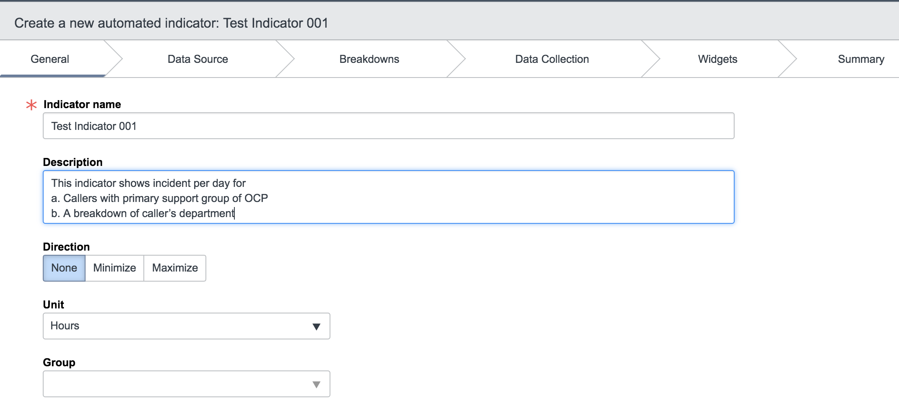
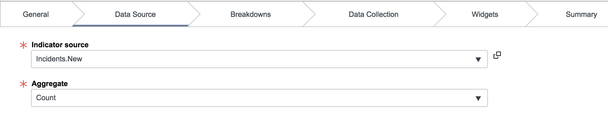
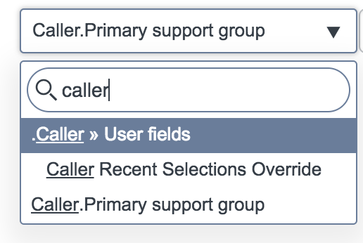
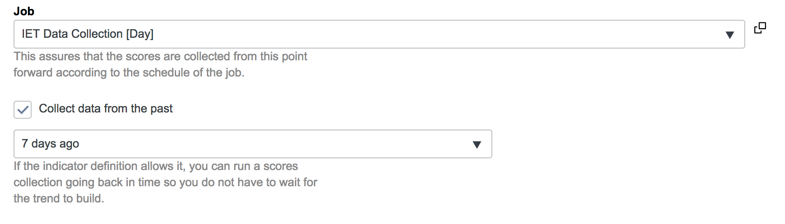

# Performance Analytics Indicators Tutorial
**Indicators** are measurements of performance overtime.
**Automated indicators** provides scores directly from any ServiceNow data table.
**Manual indicators** allow us to insert scores manually to protect sensitive information. They can also be used for data that can not be retrieved from your ServiceNow instance because it comes from an outside system.
**Formula indicators** allow us to calculate important performance data from information we already have present in the existing automated and manual indicators. 

# Create an Indicator
In this section we will be creating an indicator that shows incident volume per day for:
- Callers with primary support group of OCP
- A breakdown of caller’s department
- A breakdown of contact type

**General**
To create an indicator, navigate to performance analytics -> Indicators -> Create New.
The interface should look like this:

Name your indicator and put the description in the description box.
Select "Days" as the unit.

**Data Source**

Select "Incidents.New" as the indicator source.
Select "Count" as the aggregate.

In the filter condition, type in "caller" and select "caller >> User fields". After this the drop down menu will close. When you open it back up you will be able to choose from the user fields for caller. Choose "primary support group". 
Configure the filter condition to be "Primary support group is OCP".

**Breakdown**
In the breakdown menu, select caller's department and contact type. 
Select "collect breakdown matrix". 
*Most people who would request indicators would want the matrix but would have no idea how to specify that. Always ask if a breakdown matrix is needed.*

**Data Collection**
Complete the data collection section as follows:

Leave the "widgets" section blank, and apply the indicator.

# Now let's try another one.
This time the indicator will be showing average resolution time of incidents for,
- Callers with primary support group OCP
- A breakdown of caller’s department
- A breakdown of resolution code